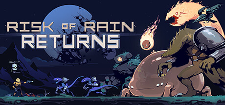

---
title:
date: '2023-12-15T00:00:00+01:00'
draft: false
share: false
commentable: false
editable: false

# Optional header image (relative to `static/media/` folder).
header:
  caption: ''
  image: ''
---
<head>
  <link rel="stylesheet" href="gaming.css">
  <meta name="viewport" content="width=device-width, initial-scale=1, shrink-to-fit=no">
</head>

<body>
	<section class="banner" style='margin-top: 10px;'>
		

      

				

				

					
				

				

			

    

	</section>

 <section class="bottom" style='margin-top: 5px;'>
    

        

            

            

              

          <iframe src="https://www.loom.com/embed/17c8a5929c2940b58bf44e4a7ba0160d?sid=5ec6b5c5-c47a-49ea-921c-58b978e03c28?hide_owner=true&hide_share=true&hide_title=true&hideEmbedTopBar=true" frameborder="0" webkitallowfullscreen mozallowfullscreen allowfullscreen style="margin-right: auto; margin-left: auto; width: 95%; height: 95%;">
          </iframe>
          

            

            

        

      

            

            

                    <a href="https://www.loom.com/share/3a0d22d1c18641bf99faed49b4491c15?sid=656b781c-a4c7-4d0a-b992-257a2b54cc2c" class='btn btn-contact btn-lrg btn-block' style='font-size: 16px;'> <i class="fa-solid fa-download" style='color: white;'></i> Commando </a>
              <a href="https://www.loom.com/share/3a0d22d1c18641bf99faed49b4491c15?sid=656b781c-a4c7-4d0a-b992-257a2b54cc2c" class='btn btn-contact btn-lrg btn-block' style='font-size: 16px;'> <i class="fa-solid fa-download" style='color: white;'></i> Huntress </a>
            

            

        

    

</section>

  <section class="banner" style='margin-top: 10px;'>
		

      

				

				

					
				

				

			

    

	</section>

  <section class="primary-info" style='margin-bottom: 25px;'>
		

			

				

					
Allyson Stoll

					
Simulation Manager

					
Stream Systems

				

				

					
				

			

		

	</section>

<section class='secondary-info'>
	<a href="mailto:astoll@streamsystems.ca">
		

			

				

					  <i class="fa-solid fa-envelope"></i>
				

				

						
astoll@streamsystems.ca

				

				

            <i class="fa-solid fa-angle-right"></i>
				

			

     

  </a>
</section>

<section class="secondary-info">
    <a href="tel:+12369854170">
        

            

                

                    <i class="fa-solid fa-phone"></i>
                

                

                    
+1 (236) 985-4170

                

                

                    <i class="fa-solid fa-angle-right"></i>
                

            

        

    </a>
</section>
  
<section class="secondary-info">
    <a href="http://www.streamsystems.ca">
        

            

                

                    <i class="fa-regular fa-globe"></i>
                

                

                    
www.streamsystems.ca

                

                

                    <i class="fa-solid fa-angle-right"></i>
                

            

        

    </a>
</section>
  
<section class="secondary-info">
    <a href = "https://www.google.com.sg/maps/place/Stream+Systems/@51.0499098,-114.0667229,17z/data=!3m2!4b1!5s0x53716ffc8f043a51:0x2ceecb4fd7d8a09d!4m6!3m5!1s0x53716ff94e90c69b:0x65fb828b1eaa4b80!8m2!3d51.0499098!4d-114.0641426!16s%2Fg%2F11rgh78mt5?entry=ttu">
        

            

                

                    <i class="fa-solid fa-location-dot"></i>
                

                

                    
140 4 Ave SW Suite 2620 Calgary, AB T2P 3N3 Canada

                

                

                    <i class="fa-solid fa-angle-right"></i>
                

            

        

    </a>
</section>
  
<section class="bottom" style='margin-top: 10px;'>
    

        

            

            

                    <a href="https://www.linkedin.com/in/allysonstoll" class='btn btn-contact btn-lrg btn-block' style='font-size: 16px;'> <i class="fa-brands fa-linkedin" style='color: white;'></i> LinkedIn </a>
            

            

        

      

            

            

                    <a href="assets/allyson.vcf" class='btn btn-contact btn-lrg btn-block' style='font-size: 16px;'> <i class="fa-solid fa-download" style='color: white;'></i> Download </a>
            

            

        

    

</section>

</body>
